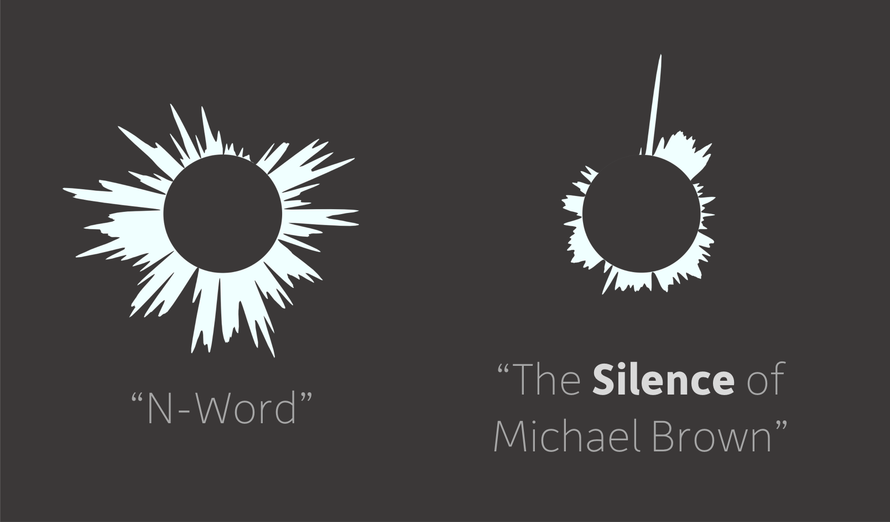

# Poem Visualization
Python scripts to take audio files (e.g. of spoken word poetry) and transform them into a abstract vizualization of the energy.

## Examples

Video: ["Intellectual Brotha"](https://www.youtube.com/watch?v=lMGJ6fK2I9s)

Videos: 
* ["The Silence of Michael Brown"](https://www.youtube.com/watch?v=kYVwLbVInaE)
* ["N*****"](https://www.youtube.com/watch?v=KApPT_XTEYs&t=1s)
